<div align="center">

<!-- ============================================ -->
<!-- 🚀 2040 HOLOGRAPHIC PROFESSIONAL PROFILE 🚀 -->
<!-- ============================================ -->

<!-- 2040 HOLOGRAPHIC HEADER -->


<!-- 2040 HOLOGRAPHIC TYPING ANIMATION -->
<a href="https://git.io/typing-svg">
  
</a>

<br>

<!-- QUANTUM DIVIDER -->


<!-- 2040 HOLOGRAPHIC SOCIAL MATRIX -->
<p align="center">
  <a href="https://linkedin.com/in/gokulraj077">
    
  </a>
  <a href="https://github.com/gokul2005083-source">
    
  </a>
  <a href="mailto:gokul2005.08.3@gmail.com">
    
  </a>
  <a href="tel:8807844079">
    
  </a>
</p>

<!-- 2040 STATUS MATRIX -->
<p align="center">
  
  
  
  
</p>

<!-- 2040 HOLOGRAPHIC TROPHY MATRIX -->
<p align="center">
  
</p>

</div>

<!-- ============================================ -->
<!-- 2040 SECTION DIVIDER -->
<!-- ============================================ -->


##  **WHO AM I?** 


```yaml
🌱 IDENTITY:
  name: "Gokul Raj"
  role: ["Agricultural Engineering Student", "Data Analytics Specialist"]
  institution: "Perunthalaivar Kamarajar Institute of Engineering & Technology"
  coordinates: "Chennai, Tamil Nadu, India 🇮🇳"
  graduation: "2026"
  contact_protocols:
    email: "gokul2005.08.3@gmail.com"
    github: "gokul2005083-source"
    phone: "+91 8807844079"
  
🎯 MISSION:
  primary: "Revolutionize agriculture through data-driven intelligence"
  approach: "Merging AgriTech expertise with advanced analytics & AI"
  vision: "Building sustainable, technology-powered farming solutions"
  
⚡ UNIQUE_VALUE:
  - Agricultural domain knowledge + Technical analytics skills
  - Hands-on farming experience + AI/ML implementation
  - Data visualization + Agricultural consulting
  - Full-stack development + Precision agriculture
```

<br clear="right"/>

### 💡 **Professional Overview**

<table>
<tr>
<td width="50%" valign="top" style="background: linear-gradient(135deg, #000000 0%, #1a1a1a 100%); border: 2px solid #FFD700; border-radius: 15px; padding: 20px;">

#### 🌾 **Agricultural Expertise**
Hands-on experience at **ICAR - Krishi Vigyan Kendra** working with sustainable farming practices, precision agriculture, and modern cultivation techniques. Strong foundation in organic farming, irrigation systems, and agricultural innovation.

</td>
<td width="50%" valign="top" style="background: linear-gradient(135deg, #1a1a1a 0%, #000000 100%); border: 2px solid #FFD700; border-radius: 15px; padding: 20px;">

#### 📊 **Data Analytics Excellence**
Specialized in transforming agricultural data into actionable insights using **Power BI**, **Python**, and **AI/ML**. Built interactive dashboards and predictive models that bridge technology with farming intelligence.

</td>
</tr>
</table>

**🎯 Unique Value Proposition:**
> Merging agricultural domain knowledge with advanced data analytics to build smart, sustainable, technology-powered farming solutions.

<details>
<summary><b>🔍 Learn More About My Approach</b></summary>
<br>

I specialize in **AgriTech innovation** — combining hands-on farming experience with cutting-edge data science. My work focuses on making agriculture more efficient, sustainable, and profitable through intelligent data systems, predictive analytics, and AI automation.

**Core Focus Areas:**
- 🌱 Smart farming solutions powered by data
- 📈 Predictive analytics for crop management  
- 🤖 AI-driven agricultural automation
- 💡 Business intelligence for farming decisions

</details>


## 🎓 **EDUCATION**

<div align="center">

<table style="border: 3px solid #FFD700; background: linear-gradient(135deg, #000000 0%, #1a1a1a 100%);">
<tr>
<td align="center" width="100%" style="padding: 30px;">
<br>
<h2 style="color: #FFD700;">🎓 B.Tech in Agricultural Engineering</h2>
<strong style="color: #FFFFFF; font-size: 18px;">Perunthalaivar Kamarajar Institute of Engineering and Technology</strong><br>
<sub style="color: #FFD700; font-size: 14px;">Nedungadu, Karaikal, Puducherry (2022 - 2026)</sub><br><br>

</td>
</tr>
</table>

</div>


## 💼 **PROFESSIONAL EXPERIENCE** 

<div align="center">

<table style="border: 3px solid #FFD700;">
<tr>
<td width="50%" valign="top" style="background: linear-gradient(135deg, #000000 0%, #1a1a1a 100%); padding: 25px; border-right: 2px solid #FFD700;">

#### 🚜 **Intern - ICAR Krishi Vigyan Kendra**
**ICAR - Krishi Vigyan Kendra, Puducherry**


**Key Achievements:**
- ✅ Gained practical exposure to **advanced agricultural techniques**
- ✅ Supported **farmer workshops** on sustainable practices
- ✅ Training in:
  - 🌱 Organic Farming
  - 🏡 Protected Cultivation
  - 🎯 Precision Agriculture
  - 💐 Floriculture
  - 🐝 Beekeeping
  - 🍄 Mushroom Cultivation
  - 💧 Irrigation Systems

</td>
<td width="50%" valign="top" style="background: linear-gradient(135deg, #1a1a1a 0%, #000000 100%); padding: 25px;">

#### 📊 **Data Analytics Intern**
**Novitech R&D Private Limited**


**Key Achievements:**
- ✅ Designed **interactive Power BI dashboards**
- ✅ **COVID-19 District Analysis Dashboard**
- ✅ **Amazon Prime Content Analytics**
- ✅ Delivered **data-driven recommendations**
- ✅ Implemented **automated reporting**

</td>
</tr>
<tr>
<td colspan="2" valign="top" style="background: linear-gradient(135deg, #000000 0%, #1a1a1a 100%); padding: 25px; border-top: 2px solid #FFD700;">

#### 🤖 **AI & Machine Learning Intern**
**Private Project Experience**


**Technical Achievements:**
- ✅ Hands-on experience in **AI and ML algorithms**
- ✅ **Machine learning models** for predictive analysis
- ✅ **Deep learning techniques** for pattern recognition
- ✅ Built **AI-powered projects**: Chatbots, Voice Assistants, Websites

</td>
</tr>
</table>

</div>


## 🛠️ **TECHNOLOGY STACK** 

<div align="center">

### 💻 **Data Analytics & Programming**

<table style="border: 3px solid #FFD700; background: linear-gradient(135deg, #000000 0%, #1a1a1a 100%);">
<tr>
<td align="center" width="14.28%" style="padding: 20px;">

<br><strong style="color: #FFD700;">Python</strong>
<br><sub style="color: #FFFFFF;">Pandas | NumPy</sub>
</td>
<td align="center" width="14.28%" style="padding: 20px;">

<br><strong style="color: #FFD700;">SQL</strong>
<br><sub style="color: #FFFFFF;">Database Design</sub>
</td>
<td align="center" width="14.28%" style="padding: 20px;">

<br><strong style="color: #FFD700;">Power BI</strong>
<br><sub style="color: #FFFFFF;">Dashboards</sub>
</td>
<td align="center" width="14.28%" style="padding: 20px;">

<br><strong style="color: #FFD700;">Excel</strong>
<br><sub style="color: #FFFFFF;">Analytics</sub>
</td>
<td align="center" width="14.28%" style="padding: 20px;">

<br><strong style="color: #FFD700;">AI/ML</strong>
<br><sub style="color: #FFFFFF;">ChatGPT</sub>
</td>
<td align="center" width="14.28%" style="padding: 20px;">

<br><strong style="color: #FFD700;">MongoDB</strong>
<br><sub style="color: #FFFFFF;">NoSQL</sub>
</td>
<td align="center" width="14.28%" style="padding: 20px;">

<br><strong style="color: #FFD700;">Git</strong>
<br><sub style="color: #FFFFFF;">Version Control</sub>
</td>
</tr>
</table>

### 🎨 **Development & Design Tools**

<p align="center">

</p>

### 🌾 **Agricultural Technology Expertise**

<table style="border: 3px solid #FFD700; background: linear-gradient(135deg, #1a1a1a 0%, #000000 100%);">
<tr>
<td align="center" width="16.66%" style="padding: 15px;">
🌱<br><strong style="color: #FFD700;">Organic Farming</strong><br><sub style="color: #FFFFFF;">Sustainable Practices</sub>
</td>
<td align="center" width="16.66%" style="padding: 15px;">
🏡<br><strong style="color: #FFD700;">Protected Cultivation</strong><br><sub style="color: #FFFFFF;">Greenhouse Tech</sub>
</td>
<td align="center" width="16.66%" style="padding: 15px;">
💧<br><strong style="color: #FFD700;">Irrigation Systems</strong><br><sub style="color: #FFFFFF;">Drip & Sprinkler</sub>
</td>
<td align="center" width="16.66%" style="padding: 15px;">
🎯<br><strong style="color: #FFD700;">Precision Agriculture</strong><br><sub style="color: #FFFFFF;">Smart Farming</sub>
</td>
<td align="center" width="16.66%" style="padding: 15px;">
💐<br><strong style="color: #FFD700;">Floriculture</strong><br><sub style="color: #FFFFFF;">Flower Farming</sub>
</td>
<td align="center" width="16.66%" style="padding: 15px;">
🐝<br><strong style="color: #FFD700;">Beekeeping</strong><br><sub style="color: #FFFFFF;">Apiculture</sub>
</td>
</tr>
</table>

### 🔧 **Complete Tech Stack Badges**


</div>


## 📊 **GITHUB ANALYTICS DASHBOARD** 

<div align="center">

<!-- 2040 HOLOGRAPHIC ACTIVITY GRAPH -->


<br><br>

<!-- 2040 STATS GRID -->


<!-- 2040 LANGUAGE DISTRIBUTION -->


<!-- 2040 PROFILE SUMMARY -->


</div>


## 🎯 **FEATURED PROJECTS** 

<div align="center">

### 📊 **Data Analytics Projects**

<table style="border: 3px solid #FFD700; background: #000000;">
<tr>
<td width="50%" valign="top" style="padding: 25px; border-right: 2px solid #FFD700;">

#### 📈 **COVID-19 District Analysis Dashboard**


**Features:**
- 🗺️ Geographic visualization of cases by district
- 📊 Time-series analysis of infection trends
- 🎯 Interactive filters for date ranges
- 📈 Predictive analytics for projections
- 💡 Real-time metrics dashboard

</td>
<td width="50%" valign="top" style="padding: 25px;">

#### 🎬 **Amazon Prime Content Analytics**


**Features:**
- 🎥 Content library analysis
- 🌍 Geographic content distribution
- 📅 Release trends over time
- ⭐ Rating analysis and genre breakdown
- 🔍 Advanced filtering capabilities

</td>
</tr>
</table>

### 🤖 **AI & Development Projects**

<table style="border: 3px solid #FFD700; background: #000000;">
<tr>
<td width="33%" align="center" style="padding: 20px; border-right: 2px solid #FFD700;">

#### 🤖 **Intelligent Chatbot**


**Features:**
- Natural language understanding
- Multi-intent conversations
- Context-aware responses
- Web platform integration

</td>
<td width="33%" align="center" style="padding: 20px; border-right: 2px solid #FFD700;">

#### 🎙️ **AI Voice Assistant**


**Features:**
- Voice command recognition
- Text-to-speech synthesis
- Task automation
- Smart integration

</td>
<td width="33%" align="center" style="padding: 20px;">

#### 🌐 **Website Development**


**Technologies:**
- HTML5, CSS3, JavaScript
- Responsive design
- SEO optimization
- Custom functionality

</td>
</tr>
</table>

[](https://github.com/gokul2005083-source?tab=repositories)

</div>


## 🏆 **CERTIFICATIONS & ACHIEVEMENTS** 

<div align="center">

### 📜 **Professional Certifications**

<table style="border: 3px solid #FFD700; background: linear-gradient(135deg, #000000 0%, #1a1a1a 100%);">
<tr>
<td width="50%" valign="top" style="padding: 25px; border-right: 2px solid #FFD700;">

#### 📊 **Data Analytics & Visualization**


✅ **Microsoft Power BI** - Skill Nation (2025)
<br>✅ **Power BI Foundation** - Anexas Europe (2025)
<br>✅ **Essentials of Data Visualization** - Acacia University (2025)
<br>✅ **Excel Using AI** - OfficeMaster (2025)

</td>
<td width="50%" valign="top" style="padding: 25px;">

#### 🤖 **Artificial Intelligence & ML**


✅ **AI Tools & ChatGPT Workshop** - be10x (2025)
<br>✅ **ChatGPT for Everyone** - Learn Prompting (2025)
<br>✅ **Dialogflow Essentials Certification**
<br>✅ **Savishkar National Workshop** - R.V. College of Engineering

</td>
</tr>
</table>

### 🎓 **Skill Development Timeline**

```mermaid
%%{init: {'theme':'base', 'themeVariables': { 'primaryColor':'#FFD700','primaryTextColor':'#000000','primaryBorderColor':'#FFFFFF','lineColor':'#FFD700','secondaryColor':'#FFFFFF','tertiaryColor':'#1a1a1a'}}}%%

graph LR
    A[🎓 2022<br/>Started B.Tech] --> B[📊 2023<br/>Power BI Training]
    B --> C[🤖 2024<br/>AI & ML Workshop]
    C --> D[🌾 2024<br/>AgriTech Internship]
    D --> E[💼 2025<br/>Data Analytics Intern]
    E --> F[🚀 2026<br/>Graduate & Career Launch]
    
    style A fill:#1a1a1a,stroke:#FFD700,stroke-width:3px,color:#FFD700
    style B fill:#1a1a1a,stroke:#FFD700,stroke-width:3px,color:#FFD700
    style C fill:#1a1a1a,stroke:#FFFFFF,stroke-width:3px,color:#FFFFFF
    style D fill:#1a1a1a,stroke:#FFD700,stroke-width:3px,color:#FFD700
    style E fill:#1a1a1a,stroke:#FFFFFF,stroke-width:3px,color:#FFFFFF
    style F fill:#FFD700,stroke:#FFFFFF,stroke-width:4px,color:#000000
```



### 🌟 **Certification Badges Matrix**

<p align="center">


</p>

</div>


## 🌟 **STRENGTHS & ACHIEVEMENTS** 

<div align="center">


<br>

<table style="border: 3px solid #FFD700; background: #000000;">
<tr>
<td width="50%" valign="top" style="padding: 25px; border-right: 2px solid #FFD700;">

### 🎯 **Key Strengths**


**Core Competencies:**
- 🌾 Agricultural domain expertise with field experience
- 📊 Advanced data analytics and BI
- 🤖 AI/ML integration for automation
- 🎨 Creative design and documentation
- 🤝 Strong teamwork and management

</td>
<td width="50%" valign="top" style="padding: 25px;">

### 🏆 **Notable Achievements**


**Professional Impact:**
- ✅ Built Power BI dashboards for real cases
- ✅ Developed AI chatbots and voice assistants
- ✅ Conducted farmer workshops
- ✅ Active in rural agricultural education
- ✅ Member of technical societies

</td>
</tr>
</table>

</div>


## 💭 **PHILOSOPHY & VISION** 

<div align="center">


<br>

<table style="border: 3px solid #FFD700; background: linear-gradient(135deg, #000000 0%, #1a1a1a 100%);">
<tr>
<td width="33%" align="center" style="padding: 25px; border-right: 2px solid #FFD700;">

### 🌾 **Agricultural Vision**


*"Technology amplifies the farmer's wisdom, creating a sustainable future"*

</td>
<td width="33%" align="center" style="padding: 25px; border-right: 2px solid #FFD700;">

### 📊 **Data Philosophy**


*"Data is the soil, analytics is the fertilizer, AI is tomorrow's harvest"*

</td>
<td width="33%" align="center" style="padding: 25px;">

### 🚀 **Innovation Drive**


*"Building solutions at the intersection of agriculture and technology"*

</td>
</tr>
</table>

</div>


## 🤝 **LET'S CONNECT** 

<div align="center">


<br>

### 📫 **Contact Information**

<table style="border: 3px solid #FFD700; background: linear-gradient(135deg, #000000 0%, #1a1a1a 100%);">
<tr>
<td align="center" width="25%" style="padding: 25px; border-right: 1px solid #FFD700;">
<br>
<a href="https://linkedin.com/in/gokulraj077">

</a>
<br><sub style="color: #FFFFFF;"><b>Professional Network</b></sub>
</td>
<td align="center" width="25%" style="padding: 25px; border-right: 1px solid #FFD700;">
<br>
<a href="mailto:gokul2005.08.3@gmail.com">

</a>
<br><sub style="color: #FFFFFF;"><b>gokul2005.08.3@gmail.com</b></sub>
</td>
<td align="center" width="25%" style="padding: 25px; border-right: 1px solid #FFD700;">
<br>
<a href="https://github.com/gokul2005083-source">

</a>
<br><sub style="color: #FFFFFF;"><b>gokul2005083-source</b></sub>
</td>
<td align="center" width="25%" style="padding: 25px;">
<br>
<a href="tel:8807844079">

</a>
<br><sub style="color: #FFFFFF;"><b>+91 8807844079</b></sub>
</td>
</tr>
</table>

<br>

**🌍 Location:** Chennai, Tamil Nadu, India | Open to Remote, Hybrid & Relocation

</div>


## 💖 **SUPPORT MY JOURNEY**

<div align="center">

If you find my work interesting or valuable:

<table style="border: 3px solid #FFD700; background: #000000; width: 95%;">
<tr>
<td align="center" width="33%" style="padding: 25px; border-right: 2px solid #FFD700;">
⭐<br><strong style="color: #FFD700; font-size: 18px;">Star My Repos</strong><br><br>
<a href="https://github.com/gokul2005083-source?tab=repositories">

</a>
<br><br>
<sub style="color: #FFFFFF;">Help projects grow</sub>
</td>
<td align="center" width="33%" style="padding: 25px; border-right: 2px solid #FFD700;">
👤<br><strong style="color: #FFD700; font-size: 18px;">Follow Me</strong><br><br>
<a href="https://github.com/gokul2005083-source">

</a>
<br><br>
<sub style="color: #FFFFFF;">Stay updated on innovations</sub>
</td>
<td align="center" width="33%" style="padding: 25px;">
📢<br><strong style="color: #FFD700; font-size: 18px;">Share</strong><br><br>

<br><br>
<sub style="color: #FFFFFF;">Spread the word</sub>
</td>
</tr>
</table>

<br>

---


---

<br>

<!-- 2040 FOOTER WAVE -->


<!-- 2040 BADGES -->


<br><br>

**✨ If my journey inspires you, star my repositories! ✨**

<br>

<!-- 2040 FOOTER ANIMATION -->


</div>

<!-- ============================================ -->
<!-- 🏁 2040 PROFILE COMPLETE 🏁 -->
<!-- ============================================ -->
