<div align="center">

<!-- ANIMATED GRADIENT BANNER -->


<!-- DYNAMIC TYPING EFFECT -->
<a href="https://git.io/typing-svg"></a>

<br>

<!-- SOCIAL BADGES -->
[](https://linkedin.com/in/gokulraj077)
[](mailto:gokul2005.08.3@gmail.com)
[](#)


</div>

---

## 🎯 Professional Synopsis

```yaml
role: "Data Analytics Engineer"
mission: "Architecting end-to-end data ecosystems that transform complexity into clarity"
approach: "AI-assisted collection → SQL engineering → Python analytics → Executive visualization"
impact: "Delivering actionable intelligence through enterprise-grade analytics systems"
```

<details>
<summary>📖 <b>More About My Journey</b></summary>
<br>

I don't just analyze data — I engineer complete analytics ecosystems. From architecting scalable databases to deploying AI-powered insights on executive dashboards, I build systems that turn raw information into strategic competitive advantages.

**What Sets Me Apart:**
- 🎯 End-to-end ownership from data ingestion to stakeholder presentation
- 🤖 AI integration for intelligent automation and predictive analytics
- 📊 Business-first approach: every metric tells a story, every dashboard drives decisions
- 🔧 Production-ready solutions with focus on scalability and maintainability

</details>

---

## 🛠️ Technical Arsenal

<div align="center">

### Core Technologies

<table>
<tr>
<td align="center" width="25%">
<br>
<sub><b>Python</b></sub><br>
<sub>NumPy • Pandas • Analytics</sub>
</td>
<td align="center" width="25%">
<br>
<sub><b>SQL</b></sub><br>
<sub>Database Engineering</sub>
</td>
<td align="center" width="25%">
<br>
<sub><b>MongoDB</b></sub><br>
<sub>NoSQL Architecture</sub>
</td>
<td align="center" width="25%">
<br>
<sub><b>Power BI</b></sub><br>
<sub>Executive Dashboards</sub>
</td>
</tr>
</table>

### Development Ecosystem


</div>

---

## 📊 GitHub Performance Matrix

<div align="center">


</div>

---

## 💼 Featured Project Showcase

<div align="center">

### 📚 Enterprise Book Sales Analytics Platform


</div>

**System Architecture:**
```
AI Data Collection → SQL Data Warehouse → Python Analytics Engine → MongoDB Storage → Power BI Dashboards
```

**Key Achievements:**
- 🎯 **End-to-End Pipeline:** Automated data flow from collection to visualization
- 📊 **Executive Dashboards:** Real-time KPI tracking with drill-down capabilities
- 🔍 **Predictive Analytics:** Sales forecasting and trend analysis
- 🏗️ **Scalable Architecture:** Designed for enterprise-level data volumes
- 📈 **Business Impact:** Actionable insights driving strategic decisions

**Technology Stack:**
`Python` • `SQL` • `MongoDB` • `Power BI` • `Pandas` • `NumPy` • `Matplotlib`

<div align="center">

[](#)
[](#)
[](#)

</div>

---

## 🎯 Professional Vision

```mermaid
graph LR
    A[Raw Data] -->|AI Collection| B[Structured Storage]
    B -->|SQL Engineering| C[Data Warehouse]
    C -->|Python Analytics| D[Insights Engine]
    D -->|Power BI| E[Executive Dashboards]
    E -->|Strategic Decisions| F[Business Impact]
    
    style A fill:#0D1117,stroke:#00D9FF,color:#fff
    style B fill:#0D1117,stroke:#00D9FF,color:#fff
    style C fill:#0D1117,stroke:#00D9FF,color:#fff
    style D fill:#0D1117,stroke:#00D9FF,color:#fff
    style E fill:#0D1117,stroke:#00D9FF,color:#fff
    style F fill:#00D9FF,stroke:#00D9FF,color:#000
```

<div align="center">



</div>

> **Mission:** To join forward-thinking organizations where data analytics, AI automation, and strategic intelligence converge to create measurable business transformation.

---

## 🌟 Core Competencies

<table>
<tr>
<td width="50%">

**🔧 Technical Excellence**
- Advanced SQL query optimization
- Python data pipeline automation
- NoSQL database architecture
- ETL process design & implementation
- Statistical analysis & modeling

</td>
<td width="50%">

**📊 Business Intelligence**
- Executive dashboard design
- KPI framework development
- Predictive analytics & forecasting
- Data storytelling & visualization
- Stakeholder communication

</td>
</tr>
</table>

---

## 📈 Current Focus

```python
class DataEngineer:
    def __init__(self):
        self.name = "Gokul Raj"
        self.role = "Data Analytics Engineer"
        self.currently_learning = [
            "Advanced ML algorithms",
            "Cloud data platforms (AWS/Azure)",
            "Real-time streaming analytics",
            "Advanced Power BI DAX"
        ]
        self.looking_for = "Enterprise analytics opportunities"
    
    def say_hi(self):
        print("Let's transform data into strategic advantage!")

me = DataEngineer()
me.say_hi()
```

---

## 🤝 Let's Connect

<div align="center">

I'm always interested in collaborating on innovative data projects or discussing analytics strategies.

**Reach out via:**

[](https://linkedin.com/in/gokulraj077)
[](mailto:gokul2005.08.3@gmail.com)
[](https://github.com/gokul2005083-source)

**Response Time:** Within 24 hours | **Open to:** Full-time roles, consulting, collaboration

</div>

---

<div align="center">

### 💭 Philosophy

*"Data is the new oil, but analytics is the refinery that turns it into gold."*

---


**⭐ If you find my work interesting, consider starring my repositories!**


</div>
