<div align="center">

<!-- ============================================ -->
<!-- 🌟 HOLOGRAPHIC PROFILE 2040 🌟 -->
<!-- ============================================ -->

<!-- QUANTUM HOLOGRAPHIC HEADER -->


<!-- QUANTUM TYPING MATRIX -->
<a href="https://git.io/typing-svg">
  
</a>

<br>

<!-- QUANTUM DIVIDER -->


<!-- HOLOGRAPHIC SOCIAL MATRIX -->
<p align="center">
  <a href="https://linkedin.com/in/gokulraj077">
    
  </a>
  <a href="https://github.com/gokul2005083-source">
    
  </a>
  <a href="mailto:gokul2005.08.3@gmail.com">
    
  </a>
  <a href="tel:8807844079">
    
  </a>
</p>

<!-- QUANTUM STATUS MATRIX -->
<p align="center">
  
  
  
  
</p>

<!-- HOLOGRAPHIC TROPHY MATRIX -->
<p align="center">
  
</p>

</div>

<!-- ============================================ -->
<!-- QUANTUM SECTION DIVIDER -->
<!-- ============================================ -->


##  **⚛️ NEURAL IDENTITY MATRIX** 


```yaml
⚡ QUANTUM_IDENTITY:
  designation: "Gokul Raj"
  neural_roles: 
    - "Agricultural Intelligence Architect"
    - "Quantum Data Scientist"
    - "Neural AgriTech Engineer"
  institution: "Perunthalaivar Kamarajar Institute of Engineering & Technology"
  coordinates: "Chennai, Tamil Nadu, India 🇮🇳"
  graduation_sequence: "2026"
  contact_protocols:
    email: "gokul2005.08.3@gmail.com"
    github: "gokul2005083-source"
    neural_link: "+91 8807844079"
  
🎯 QUANTUM_MISSION:
  prime_directive: "Architecting the future of agriculture through quantum data intelligence"
  methodology: "Fusion of AgriTech mastery with neural analytics & quantum AI"
  vision_2040: "Building self-sustaining, AI-orchestrated farming ecosystems"
  
⚡ UNIQUE_QUANTUM_VALUE:
  synthesis:
    - "Agricultural domain intelligence + Quantum data architectures"
    - "Bio-farming expertise + Neural AI implementation"
    - "Holographic data visualization + Agricultural consulting 4.0"
    - "Full-stack quantum development + Precision agriculture IoT"
  differentiation: "Where traditional wisdom meets quantum technology"
```

<br clear="right"/>

### 💎 **Holographic Professional Matrix**

<table>
<tr>
<td width="50%" valign="top" style="background: linear-gradient(135deg, #000000 0%, #1a1a1a 100%); border: 2px solid #FFD700; border-radius: 15px; padding: 20px;">

#### 🌾 **Agricultural Quantum Intelligence**
Field-deployed experience at **ICAR - Krishi Vigyan Kendra** implementing next-generation sustainable farming protocols, precision agriculture systems, and bio-integrated cultivation frameworks. Deep expertise in organic farming matrices, intelligent irrigation networks, and agricultural innovation pipelines.

</td>
<td width="50%" valign="top" style="background: linear-gradient(135deg, #1a1a1a 0%, #000000 100%); border: 2px solid #FFD700; border-radius: 15px; padding: 20px;">

#### 🔮 **Data Science Mastery**
Specialized in transforming agricultural big data into predictive intelligence using **Power BI**, **Python Neural Networks**, and **Quantum AI/ML Algorithms**. Architected real-time dashboards and predictive models that bridge quantum technology with farming intelligence.

</td>
</tr>
</table>

**🎯 Quantum Value Synthesis:**
> Merging deep agricultural domain mastery with advanced quantum data architectures to build intelligent, self-sustaining, AI-powered farming solutions for 2040 and beyond.

<details>
<summary><b>🔍 Deep Dive Into My Neural Approach</b></summary>
<br>

I specialize in **AgriTech Quantum Innovation** — combining hands-on bio-farming intelligence with bleeding-edge data science protocols. My work catalyzes agriculture efficiency, sustainability, and profitability through intelligent data ecosystems, predictive neural analytics, and quantum AI automation.

**Neural Focus Matrix:**
- 🌱 AI-orchestrated smart farming solutions
- 📈 Quantum predictive analytics for crop intelligence  
- 🤖 Neural-driven agricultural automation systems
- 💡 Business intelligence frameworks for farming optimization
- 🌐 Blockchain-integrated supply chain transparency
- 🔬 IoT sensor networks for precision agriculture

</details>


## 🎓 **NEURAL EDUCATION MATRIX**

<div align="center">

<table style="border: 3px solid #FFD700; background: linear-gradient(135deg, #000000 0%, #1a1a1a 100%);">
<tr>
<td align="center" width="100%" style="padding: 30px;">
<br>
<h2 style="color: #FFD700;">⚡ B.Tech in Agricultural Engineering</h2>
<strong style="color: #FFFFFF; font-size: 18px;">Perunthalaivar Kamarajar Institute of Engineering and Technology</strong><br>
<sub style="color: #FFD700; font-size: 14px;">Nedungadu, Karaikal, Puducherry (2022 - 2026)</sub><br><br>


</td>
</tr>
</table>

</div>


## 💼 **QUANTUM EXPERIENCE MATRIX** 

<div align="center">

<table style="border: 3px solid #FFD700;">
<tr>
<td width="50%" valign="top" style="background: linear-gradient(135deg, #000000 0%, #1a1a1a 100%); padding: 25px; border-right: 2px solid #FFD700;">

#### 🚜 **AgriTech Intelligence Specialist**
**ICAR - Krishi Vigyan Kendra, Puducherry**


**Neural Achievements:**
- ⚡ Deployed **next-generation agricultural protocols**
- 🌾 Orchestrated **farmer quantum workshops**
- 🔬 Advanced training in:
  - 🌱 Organic Bio-Farming Systems
  - 🏡 Protected Quantum Cultivation
  - 🎯 Precision Agriculture IoT
  - 💐 Neural Floriculture
  - 🐝 Smart Beekeeping Automation
  - 🍄 AI-Integrated Mushroom Cultivation
  - 💧 Intelligent Irrigation Networks

</td>
<td width="50%" valign="top" style="background: linear-gradient(135deg, #1a1a1a 0%, #000000 100%); padding: 25px;">

#### 🔮 **Quantum Data Intelligence Architect**
**Novitech R&D Private Limited**


**Quantum Achievements:**
- ⚡ Architected **holographic Power BI dashboards**
- 🦠 **COVID-19 Quantum District Analysis**
- 🎬 **Amazon Prime Neural Content Analytics**
- 📊 Delivered **AI-driven strategic insights**
- 🤖 Implemented **automated intelligence reporting**
- 🔬 Built **predictive analytics engines**

</td>
</tr>
<tr>
<td colspan="2" valign="top" style="background: linear-gradient(135deg, #000000 0%, #1a1a1a 100%); padding: 25px; border-top: 2px solid #FFD700;">

#### 🧠 **Artificial Intelligence & Neural Learning Architect**
**Advanced Private Research Projects**


**Technical Quantum Achievements:**
- ⚡ Deployed **quantum AI algorithms** and **neural ML frameworks**
- 🤖 **Deep learning neural networks** for pattern intelligence
- 🧬 **Natural Language Processing** for conversational AI
- 🔮 Built **AI-powered quantum projects**: Neural Chatbots, Voice Intelligence, Holographic Websites
- 🌐 **Blockchain integration** for decentralized AgriTech
- 📡 **IoT sensor networks** for real-time agricultural monitoring

</td>
</tr>
</table>

</div>


## 🛠️ **QUANTUM TECHNOLOGY ARSENAL** 

<div align="center">

### 💻 **Neural Data Intelligence & Quantum Programming**

<table style="border: 3px solid #FFD700; background: linear-gradient(135deg, #000000 0%, #1a1a1a 100%);">
<tr>
<td align="center" width="14.28%" style="padding: 20px;">

<br><strong style="color: #FFD700;">Python</strong>
<br><sub style="color: #FFFFFF;">Pandas | NumPy | Scikit</sub>
</td>
<td align="center" width="14.28%" style="padding: 20px;">

<br><strong style="color: #FFD700;">SQL</strong>
<br><sub style="color: #FFFFFF;">Quantum Queries</sub>
</td>
<td align="center" width="14.28%" style="padding: 20px;">

<br><strong style="color: #FFD700;">Power BI</strong>
<br><sub style="color: #FFFFFF;">Neural Dashboards</sub>
</td>
<td align="center" width="14.28%" style="padding: 20px;">

<br><strong style="color: #FFD700;">Excel</strong>
<br><sub style="color: #FFFFFF;">Quantum Analytics</sub>
</td>
<td align="center" width="14.28%" style="padding: 20px;">

<br><strong style="color: #FFD700;">AI/ML</strong>
<br><sub style="color: #FFFFFF;">GPT-4 | Claude</sub>
</td>
<td align="center" width="14.28%" style="padding: 20px;">

<br><strong style="color: #FFD700;">MongoDB</strong>
<br><sub style="color: #FFFFFF;">Neural NoSQL</sub>
</td>
<td align="center" width="14.28%" style="padding: 20px;">

<br><strong style="color: #FFD700;">TensorFlow</strong>
<br><sub style="color: #FFFFFF;">Deep Learning</sub>
</td>
</tr>
</table>

### 🎨 **Quantum Development & Holographic Design Matrix**

<p align="center">

</p>

### 🌾 **Agricultural Quantum Technology Mastery**

<table style="border: 3px solid #FFD700; background: linear-gradient(135deg, #1a1a1a 0%, #000000 100%);">
<tr>
<td align="center" width="16.66%" style="padding: 15px;">
🌱<br><strong style="color: #FFD700;">Organic Farming</strong><br><sub style="color: #FFFFFF;">Bio-Sustainable</sub>
</td>
<td align="center" width="16.66%" style="padding: 15px;">
🏡<br><strong style="color: #FFD700;">Protected Cultivation</strong><br><sub style="color: #FFFFFF;">Smart Greenhouses</sub>
</td>
<td align="center" width="16.66%" style="padding: 15px;">
💧<br><strong style="color: #FFD700;">Irrigation Systems</strong><br><sub style="color: #FFFFFF;">IoT-Enabled</sub>
</td>
<td align="center" width="16.66%" style="padding: 15px;">
🎯<br><strong style="color: #FFD700;">Precision Agriculture</strong><br><sub style="color: #FFFFFF;">AI-Powered</sub>
</td>
<td align="center" width="16.66%" style="padding: 15px;">
📡<br><strong style="color: #FFD700;">IoT Sensors</strong><br><sub style="color: #FFFFFF;">Real-time Monitoring</sub>
</td>
<td align="center" width="16.66%" style="padding: 15px;">
🔗<br><strong style="color: #FFD700;">Blockchain</strong><br><sub style="color: #FFFFFF;">Supply Chain</sub>
</td>
</tr>
</table>

### 🔧 **Complete Quantum Tech Arsenal**


</div>


## 📊 **QUANTUM GITHUB ANALYTICS MATRIX** 

<div align="center">

<!-- HOLOGRAPHIC ACTIVITY GRAPH -->


<br><br>

<!-- QUANTUM STATS GRID -->


<!-- NEURAL LANGUAGE DISTRIBUTION -->


<!-- HOLOGRAPHIC PROFILE SUMMARY -->


</div>


## 🯠**QUANTUM PROJECTS SHOWCASE** 

<div align="center">

### 🔮 **Neural Data Intelligence Projects**

<table style="border: 3px solid #FFD700; background: #000000;">
<tr>
<td width="50%" valign="top" style="padding: 25px; border-right: 2px solid #FFD700;">

#### 📊 **COVID-19 Quantum District Intelligence**


**Quantum Features:**
- 🌐 **Holographic geographic visualization**
- 📈 **Neural time-series predictive analysis**
- 🎯 **Quantum interactive filtering**
- 🔮 **AI-powered projection models**
- ⚡ **Real-time intelligence dashboard**
- 🧬 **Machine learning trend detection**

</td>
<td width="50%" valign="top" style="padding: 25px;">

#### 🎬 **Amazon Prime Neural Content Oracle**


**Quantum Features:**
- 🎥 **AI-driven content intelligence**
- 🌍 **Global distribution heat maps**
- 📅 **Predictive release trend analysis**
- ⭐ **Neural rating algorithms**
- 🔍 **Quantum filtering matrix**
- 🤖 **Automated recommendation engine**

</td>
</tr>
</table>

### 🧠 **AI & Quantum Development Projects**

<table style="border: 3px solid #FFD700; background: #000000;">
<tr>
<td width="33%" align="center" style="padding: 20px; border-right: 2px solid #FFD700;">

#### 🤖 **Neural Conversation Intelligence**


**Quantum Capabilities:**
- 🔮 Natural language understanding
- 🧬 Multi-intent neural routing
- ⚡ Context-aware intelligence
- 🌐 Omnichannel deployment
- 🤖 Self-learning algorithms

</td>
<td width="33%" align="center" style="padding: 20px; border-right: 2px solid #FFD700;">

#### 🎙️ **Quantum Voice Intelligence**


**Neural Features:**
- 🗣️ Quantum voice recognition
- 🔊 Neural text-to-speech
- 🤖 Intelligent task automation
- 🌐 Smart ecosystem integration
- 🧠 Predictive command processing

</td>
<td width="33%" align="center" style="padding: 20px;">

#### 🌐 **Holographic Web Architecture**


**Technologies:**
- ⚛️ React Quantum UI
- 🚀 Node.js Neural Backend
- 🎨 Holographic CSS3
- 📱 Responsive quantum design
- 🔐 Blockchain security

</td>
</tr>
</table>

### 🌾 **AgriTech Quantum Innovation Projects**

<table style="border: 3px solid #FFD700; background: #000000;">
<tr>
<td width="50%" align="center" style="padding: 25px; border-right: 2px solid #FFD700;">

#### 🌱 **Smart Farming IoT Network**


**Neural System:**
- 🌡️ Real-time sensor monitoring
- 💧 AI-optimized irrigation
- 🤖 Automated pest detection
- 📊 Predictive crop analytics
- 🔗 Blockchain traceability

</td>
<td width="50%" align="center" style="padding: 25px;">

#### 🧬 **Crop Intelligence Prediction**


**AI Models:**
- 🌾 Yield prediction algorithms
- 🦠 Disease detection neural nets
- 🌦️ Weather impact analysis
- 📈 Market price forecasting
- 🎯 Precision resource allocation

</td>
</tr>
</table>

<br>

[](https://github.com/gokul2005083-source?tab=repositories)

</div>


## 🆠**QUANTUM CERTIFICATIONS & ACHIEVEMENTS** 

<div align="center">

### 📜 **Neural Professional Credentials**

<table style="border: 3px solid #FFD700; background: linear-gradient(135deg, #000000 0%, #1a1a1a 100%);">
<tr>
<td width="50%" valign="top" style="padding: 25px; border-right: 2px solid #FFD700;">

#### 🔮 **Data Intelligence & Quantum Visualization**


⚡ **Microsoft Power BI Neural** - Skill Nation (2025)
<br>💎 **Power BI Quantum Foundation** - Anexas Europe (2025)
<br>🔬 **Essentials of Data Visualization** - Acacia University (2025)
<br>📊 **Excel Using Quantum AI** - OfficeMaster (2025)
<br>🧠 **Advanced Analytics** - DataCamp (2025)

</td>
<td width="50%" valign="top" style="padding: 25px;">

#### 🤖 **Quantum AI & Neural Machine Learning**


⚡ **AI Tools & GPT-4 Quantum Workshop** - be10x (2025)
<br>🔮 **ChatGPT Neural Intelligence** - Learn Prompting (2025)
<br>🧬 **Dialogflow Quantum Certification** - Google Cloud
<br>🚀 **Savishkar National Innovation** - R.V. College
<br>🤖 **TensorFlow Neural Networks** - Coursera (2025)
<br>🌐 **Blockchain Fundamentals** - IBM (2025)

</td>
</tr>
</table>

### 🎓 **Quantum Skill Evolution Timeline**

```mermaid
%%{init: {'theme':'base', 'themeVariables': { 'primaryColor':'#FFD700','primaryTextColor':'#000000','primaryBorderColor':'#FFFFFF','lineColor':'#FFD700','secondaryColor':'#FFFFFF','tertiaryColor':'#1a1a1a'}}}%%

graph LR
    A[🎓 2022<br/>B.Tech Started<br/>AgriTech Foundation] --> B[🔮 2023<br/>Power BI Neural<br/>Data Intelligence]
    B --> C[🤖 2024<br/>AI/ML Quantum<br/>Neural Workshop]
    C --> D[🌾 2024<br/>ICAR AgriTech<br/>Field Intelligence]
    D --> E[💼 2025<br/>Data Analytics<br/>Quantum Internship]
    E --> F[🚀 2026<br/>Graduate Launch<br/>2040 Vision Ready]
    
    style A fill:#1a1a1a,stroke:#FFD700,stroke-width:3px,color:#FFD700
    style B fill:#1a1a1a,stroke:#FFD700,stroke-width:3px,color:#FFD700
    style C fill:#1a1a1a,stroke:#FFFFFF,stroke-width:3px,color:#FFFFFF
    style D fill:#1a1a1a,stroke:#FFD700,stroke-width:3px,color:#FFD700
    style E fill:#1a1a1a,stroke:#FFFFFF,stroke-width:3px,color:#FFFFFF
    style F fill:#FFD700,stroke:#FFFFFF,stroke-width:4px,color:#000000
```



### 🌟 **Certification Badges Matrix**

<p align="center">


</p>

</div>


## 🌟 **QUANTUM STRENGTHS & NEURAL ACHIEVEMENTS** 

<div align="center">


<br>

<table style="border: 3px solid #FFD700; background: #000000;">
<tr>
<td width="50%" valign="top" style="padding: 25px; border-right: 2px solid #FFD700;">

### ⚡ **Quantum Core Strengths**


**Neural Competencies Matrix:**
- 🌾 Agricultural quantum intelligence with field deployment
- 🔮 Advanced neural data analytics & holographic BI
- 🤖 AI/ML quantum integration & automation
- 🎨 Holographic design & quantum documentation
- 🤝 Neural team orchestration & strategic management
- 🌐 Blockchain & IoT ecosystem architecture
- 🧬 Predictive modeling & data science mastery

</td>
<td width="50%" valign="top" style="padding: 25px;">

### 🏆 **Quantum Achievement Matrix**


**Quantum Professional Impact:**
- ✅ Architected holographic Power BI intelligence
- ✅ Deployed neural AI chatbots & voice systems
- ✅ Orchestrated quantum farmer workshops
- ✅ Active in agricultural quantum education
- ✅ Core member of technical innovation societies
- ✅ Built blockchain-integrated AgriTech solutions
- ✅ Published research on AI in agriculture

</td>
</tr>
</table>

### 💎 **Quantum Skillset Radar**

<p align="center">

</p>

</div>


## 💭 **QUANTUM PHILOSOPHY & 2040 VISION** 

<div align="center">


<br>

<table style="border: 3px solid #FFD700; background: linear-gradient(135deg, #000000 0%, #1a1a1a 100%);">
<tr>
<td width="33%" align="center" style="padding: 25px; border-right: 2px solid #FFD700;">

### 🌾 **AgriTech Quantum Vision**


*"Quantum technology amplifies ancestral agricultural wisdom, architecting a self-sustaining autonomous future"*

**2040 Pillars:**
- 🤖 AI-orchestrated farming
- 🌐 Blockchain transparency
- 📡 IoT sensor networks
- 🧬 Predictive bio-analytics

</td>
<td width="33%" align="center" style="padding: 25px; border-right: 2px solid #FFD700;">

### 🔮 **Data Quantum Philosophy**


*"Data is quantum soil, neural analytics is bio-fertilizer, AI is tomorrow's exponential harvest"*

**Intelligence Framework:**
- 🧠 Predictive neural models
- 📈 Real-time intelligence
- 🔬 Quantum data mining
- ⚡ Automated insights

</td>
<td width="33%" align="center" style="padding: 25px;">

### 🚀 **Innovation Quantum Drive**


*"Architecting quantum solutions at the convergence of agriculture, AI, blockchain & IoT"*

**Innovation Ecosystem:**
- 🌍 Global impact solutions
- 🔄 Circular economy models
- 🎯 Precision agriculture 4.0
- 💎 Sustainable tech fusion

</td>
</tr>
</table>

### 🌟 **2040 Vision Statement**

<table style="border: 3px solid #FFD700; background: #000000; width: 100%;">
<tr>
<td align="center" style="padding: 30px;">
<h3 style="color: #FFD700; font-size: 24px;">⚡ ARCHITECTING THE FUTURE OF INTELLIGENT AGRICULTURE ⚡</h3>
<p style="color: #FFFFFF; font-size: 16px; line-height: 1.8;">
By 2040, I envision a world where <strong style="color: #FFD700;">AI-powered autonomous farms</strong> seamlessly integrate with <strong style="color: #FFD700;">blockchain supply chains</strong>, <strong style="color: #FFD700;">IoT sensor networks</strong> provide real-time crop intelligence, and <strong style="color: #FFD700;">quantum predictive models</strong> optimize every agricultural decision. My mission is to be at the forefront of this revolution — bridging traditional farming wisdom with cutting-edge technology to create <strong style="color: #FFD700;">sustainable, profitable, and globally scalable</strong> agricultural ecosystems.
</p>


</td>
</tr>
</table>

</div>


## 🤠**QUANTUM NEURAL LINK CONNECTION** 

<div align="center">


<br>

### 📡 **Quantum Contact Protocols**

<table style="border: 3px solid #FFD700; background: linear-gradient(135deg, #000000 0%, #1a1a1a 100%);">
<tr>
<td align="center" width="25%" style="padding: 25px; border-right: 1px solid #FFD700;">
<br>
<a href="https://linkedin.com/in/gokulraj077">

</a>
<br><sub style="color: #FFFFFF;"><b>Professional Neural Network</b></sub>
</td>
<td align="center" width="25%" style="padding: 25px; border-right: 1px solid #FFD700;">
<br>
<a href="mailto:gokul2005.08.3@gmail.com">

</a>
<br><sub style="color: #FFFFFF;"><b>gokul2005.08.3@gmail.com</b></sub>
</td>
<td align="center" width="25%" style="padding: 25px; border-right: 1px solid #FFD700;">
<br>
<a href="https://github.com/gokul2005083-source">

</a>
<br><sub style="color: #FFFFFF;"><b>gokul2005083-source</b></sub>
</td>
<td align="center" width="25%" style="padding: 25px;">
<br>
<a href="tel:8807844079">

</a>
<br><sub style="color: #FFFFFF;"><b>+91 8807844079</b></sub>
</td>
</tr>
</table>

<br>

### 🌍 **Quantum Location & Availability**

<table style="border: 3px solid #FFD700; background: #000000; width: 90%;">
<tr>
<td align="center" style="padding: 20px;">


<br><br>
<sub style="color: #FFD700; font-size: 14px;">Open to quantum collaborations worldwide • AgriTech startups • Data science teams • AI research labs</sub>
</td>
</tr>
</table>

<br>

### 🎯 **Quantum Collaboration Opportunities**

<table style="border: 3px solid #FFD700; background: linear-gradient(135deg, #1a1a1a 0%, #000000 100%);">
<tr>
<td width="33%" align="center" style="padding: 20px; border-right: 2px solid #FFD700;">
<h4 style="color: #FFD700;">🌾 AgriTech Innovation</h4>
<p style="color: #FFFFFF; font-size: 13px;">
Precision agriculture<br>
IoT sensor networks<br>
AI crop optimization<br>
Blockchain supply chain
</p>
</td>
<td width="33%" align="center" style="padding: 20px; border-right: 2px solid #FFD700;">
<h4 style="color: #FFD700;">🔮 Data Intelligence</h4>
<p style="color: #FFFFFF; font-size: 13px;">
Neural analytics dashboards<br>
Predictive modeling<br>
Business intelligence<br>
Quantum data architecture
</p>
</td>
<td width="33%" align="center" style="padding: 20px;">
<h4 style="color: #FFD700;">🤖 AI/ML Projects</h4>
<p style="color: #FFFFFF; font-size: 13px;">
Deep learning models<br>
NLP applications<br>
Computer vision<br>
Automation systems
</p>
</td>
</tr>
</table>

</div>


## 💖 **QUANTUM SUPPORT ECOSYSTEM**

<div align="center">

<br>

<table style="border: 3px solid #FFD700; background: #000000; width: 95%;">
<tr>
<td align="center" width="33%" style="padding: 25px; border-right: 2px solid #FFD700;">
⭐<br><strong style="color: #FFD700; font-size: 18px;">Star Quantum Repos</strong><br><br>
<a href="https://github.com/gokul2005083-source?tab=repositories">

</a>
<br><br>
<sub style="color: #FFFFFF;">Help amplify neural projects</sub>
</td>
<td align="center" width="33%" style="padding: 25px; border-right: 2px solid #FFD700;">
👤<br><strong style="color: #FFD700; font-size: 18px;">Join Neural Network</strong><br><br>
<a href="https://github.com/gokul2005083-source">

</a>
<br><br>
<sub style="color: #FFFFFF;">Stay updated on innovations</sub>
</td>
<td align="center" width="33%" style="padding: 25px;">
🌐<br><strong style="color: #FFD700; font-size: 18px;">Quantum Share</strong><br><br>

<br><br>
<sub style="color: #FFFFFF;">Spread the quantum vision</sub>
</td>
</tr>
</table>

<br>

---


---

<br>

<!-- QUANTUM FOOTER WAVE -->


<!-- QUANTUM BADGES -->


<br><br>

**✨ If my quantum journey inspires you, star the repositories and join the neural network! ✨**

<br>

<!-- QUANTUM FOOTER ANIMATION -->


<br><br>

<!-- HOLOGRAPHIC SIGNATURE -->
<table style="border: 2px solid #FFD700; background: linear-gradient(135deg, #000000 0%, #1a1a1a 100%); width: 60%; margin: auto;">
<tr>
<td align="center" style="padding: 20px;">

<br><br>
<sub style="color: #FFFFFF; font-size: 12px; font-style: italic;">
"In the convergence of soil and silicon, tradition and technology, data and determination —<br>
we find the blueprint for a sustainable, intelligent, and abundant future."
</sub>
<br><br>
<strong style="color: #FFD700; font-size: 16px;">⚡ NEURAL LINK AWAITS YOUR QUANTUM SIGNAL ⚡</strong>
</td>
</tr>
</table>

</div>

<!-- ============================================ -->
<!-- 🏁 QUANTUM PROFILE MATRIX COMPLETE 🏁 -->
<!-- ============================================ -->
