<div align="center">

<!-- ============================================ -->
<!-- 🚀 FUTURISTIC 2030 HOLOGRAPHIC PROFILE 🚀 -->
<!-- ============================================ -->

<!-- HOLOGRAPHIC ANIMATED HEADER -->


<!-- MATRIX RAIN EFFECT TYPING -->
<a href="https://git.io/typing-svg">
  
</a>

<br>

<!-- ANIMATED SNAKE CONTRIBUTION GRAPH -->
<picture>
  <source media="(prefers-color-scheme: dark)" srcset="https://raw.githubusercontent.com/gokul2005083-source/gokul2005083-source/output/github-contribution-grid-snake-dark.svg">
  <source media="(prefers-color-scheme: light)" srcset="https://raw.githubusercontent.com/gokul2005083-source/gokul2005083-source/output/github-contribution-grid-snake.svg">
  
</picture>

<br><br>

<!-- GLOWING SOCIAL BADGES WITH ANIMATIONS -->
<p align="center">
  <a href="https://linkedin.com/in/gokulraj077">
    
  </a>
  <a href="mailto:gokul2005.08.3@gmail.com">
    
  </a>
  <a href="#">
    
  </a>
  <a href="#">
    
  </a>
</p>

<!-- PROFILE COUNTER WITH ANIMATION -->
<p align="center">
  
  
  
</p>

<!-- ANIMATED TROPHY SHOWCASE -->
<p align="center">
  
</p>

</div>

<!-- ============================================ -->
<!-- HOLOGRAPHIC DIVIDER -->
<!-- ============================================ -->


##  **NEURAL NETWORK PROFILE**


```yaml
🧬 IDENTITY:
  name: "Gokul Raj"
  designation: "Data Analytics Engineer"
  specialization: "AI-Powered Analytics Architecture"
  
⚡ CORE_MISSION:
  objective: "Transform chaos into clarity through intelligent data systems"
  approach: "Full-stack analytics from AI ingestion to executive insights"
  
🎯 IMPACT_AREAS:
  - Enterprise Data Warehousing
  - Predictive Analytics & ML
  - Real-time Business Intelligence
  - Automated Insight Generation
  
🚀 QUANTUM_LEAP:
  status: "Building next-generation analytics platforms"
  vision: "Where AI meets actionable intelligence"
```

<br clear="right"/>

### 🌟 **What Makes Me Different**

<details open>
<summary><b>🔥 Click to Explore My Superpowers</b></summary>
<br>

```python
class NextGenDataEngineer:
    def __init__(self):
        self.expertise = {
            '🤖 AI Integration': 'ChatGPT-powered data collection & automation',
            '🗄️ Database Mastery': 'SQL & NoSQL architecture at scale',
            '🐍 Python Wizardry': 'NumPy, Pandas, Advanced Analytics',
            '📊 BI Excellence': 'Executive dashboards that tell stories',
            '🔮 Predictive Power': 'ML models that forecast the future',
            '⚡ Real-time Processing': 'Stream analytics & live insights'
        }
        
    def build_solution(self, problem):
        pipeline = [
            self.ai_data_collection(),
            self.intelligent_processing(),
            self.advanced_analytics(),
            self.visual_storytelling()
        ]
        return f"✨ Enterprise-grade solution: {problem} → Actionable Intelligence"
    
    def my_philosophy(self):
        return """
        🎯 Data alone is noise.
        💡 Analytics transforms it into music.
        🚀 I compose symphonies of insight.
        """

engineer = NextGenDataEngineer()
print(engineer.my_philosophy())
```

**🎖️ Competitive Advantages:**
- ✅ **End-to-End Ownership**: From raw data to boardroom presentation
- ✅ **AI-First Approach**: Leveraging GPT & ML for intelligent automation
- ✅ **Production Ready**: Enterprise-grade code, scalable architecture
- ✅ **Business Fluent**: Technical depth + strategic communication
- ✅ **Speed to Insight**: Rapid prototyping, faster time-to-value

</details>


## 🛠️ **TECHNOLOGY MATRIX** 

<div align="center">

### 🔮 **PRIMARY ARSENAL**

<table>
<tr>
<td align="center" width="20%">

<br><strong>Python</strong>
<br><sub>NumPy | Pandas | Matplotlib</sub>
</td>
<td align="center" width="20%">

<br><strong>MySQL</strong>
<br><sub>Database Engineering</sub>
</td>
<td align="center" width="20%">

<br><strong>MongoDB</strong>
<br><sub>NoSQL Architecture</sub>
</td>
<td align="center" width="20%">

<br><strong>Power BI</strong>
<br><sub>Executive Dashboards</sub>
</td>
<td align="center" width="20%">

<br><strong>AI/ML</strong>
<br><sub>ChatGPT Integration</sub>
</td>
</tr>
</table>

### ⚡ **DEVELOPMENT ECOSYSTEM**

<p align="center">

</p>

### 🎨 **TECH STACK BADGES**


</div>


## 📊 **ANALYTICS DASHBOARD** 

<div align="center">

<!-- ACTIVITY GRAPH -->


<br><br>

<!-- STATS PANELS -->


<!-- LANGUAGE STATS -->


<!-- PROFILE SUMMARY -->


<!-- PRODUCTIVITY STATS -->


</div>


## 💼 **FLAGSHIP PROJECT** 

<div align="center">

<!-- PROJECT BANNER -->


<br>

<!-- STATUS BADGES -->


</div>

### 🎯 **System Architecture Flow**

```mermaid
%%{init: {'theme':'base', 'themeVariables': { 'primaryColor':'#0D1117','primaryTextColor':'#00D9FF','primaryBorderColor':'#00D9FF','lineColor':'#00D9FF','secondaryColor':'#1a1a2e','tertiaryColor':'#16213e'}}}%%

graph LR
    A[🤖 AI Data<br/>Collection] -->|Automated| B[🗄️ SQL Data<br/>Warehouse]
    B -->|ETL Pipeline| C[🐍 Python<br/>Analytics Engine]
    C -->|Processing| D[📊 MongoDB<br/>Storage Layer]
    D -->|Real-time| E[💎 Power BI<br/>Dashboards]
    E -->|Insights| F[🎯 Strategic<br/>Decisions]
    
    style A fill:#1a1a2e,stroke:#00D9FF,stroke-width:3px,color:#00D9FF
    style B fill:#1a1a2e,stroke:#00D9FF,stroke-width:3px,color:#00D9FF
    style C fill:#1a1a2e,stroke:#00D9FF,stroke-width:3px,color:#00D9FF
    style D fill:#1a1a2e,stroke:#00D9FF,stroke-width:3px,color:#00D9FF
    style E fill:#1a1a2e,stroke:#00D9FF,stroke-width:3px,color:#00D9FF
    style F fill:#00D9FF,stroke:#00D9FF,stroke-width:3px,color:#000000
```



### 🏆 **Key Achievements & Features**

<table>
<tr>
<td width="50%" valign="top">

**🎯 Technical Excellence**
- ✨ **AI-Powered Collection**: Automated data ingestion using ChatGPT
- 🔄 **ETL Pipeline**: Custom-built extraction, transformation, loading
- 📈 **Predictive Models**: Sales forecasting with 95%+ accuracy
- ⚡ **Real-time Processing**: Live data updates every 15 minutes
- 🔐 **Enterprise Security**: Role-based access control & encryption

</td>
<td width="50%" valign="top">

**💼 Business Impact**
- 📊 **Executive Dashboards**: 12+ interactive Power BI reports
- 💰 **ROI Tracking**: Revenue attribution & profit analysis
- 🎯 **KPI Monitoring**: Real-time business metrics
- 📉 **Trend Analysis**: Historical patterns & forecasting
- 🚀 **Scalability**: Handles 1M+ transactions seamlessly

</td>
</tr>
</table>

### 🛠️ **Technology Stack Breakdown**

<div align="center">

| Layer | Technologies | Purpose |
|:------|:-------------|:--------|
| 🤖 **AI Layer** | ChatGPT API, Python | Intelligent data collection & automation |
| 🗄️ **Data Layer** | MySQL, MongoDB | Structured & unstructured data storage |
| 🐍 **Processing Layer** | Python, Pandas, NumPy | Data transformation & analytics |
| 📊 **Visualization** | Power BI, Matplotlib | Executive dashboards & reporting |
| 🔧 **DevOps** | Git, Docker, CI/CD | Version control & deployment |

</div>

### 📸 **Project Highlights**

<details>
<summary><b>🖼️ Click to View Screenshots & Demos</b></summary>
<br>

```
🎬 Coming Soon: Interactive Dashboard Previews
📊 Sample Visualizations & Analytics Reports
🎯 KPI Tracking Examples
📈 Predictive Model Performance Metrics
```

**Live Features:**
- 📊 Real-time sales dashboard
- 🔍 Advanced filtering & drill-down
- 📈 Trend analysis & forecasting
- 💰 Revenue analytics
- 🎯 Customer segmentation

</details>

<div align="center">

### 🔗 **Project Links**

[](https://github.com/gokul2005083-source)
[](#)
[](#)
[](#)

</div>


## 🯠**PROFESSIONAL ROADMAP** 

<div align="center">

### 🚀 **Current Mission: Building Next-Gen Analytics**

```mermaid
%%{init: {'theme':'base', 'themeVariables': { 'primaryColor':'#0D1117','primaryTextColor':'#00D9FF','primaryBorderColor':'#00D9FF','lineColor':'#00D9FF','secondaryColor':'#1a1a2e','tertiaryColor':'#16213e'}}}%%

mindmap
  root((🎯 CAREER<br/>VISION))
    🔮 Technical Mastery
      Advanced ML & AI
      Cloud Platforms
      Big Data Technologies
      Real-time Analytics
    💼 Business Impact
      Enterprise Solutions
      Strategic Consulting
      Thought Leadership
      Innovation Driver
    🌟 Continuous Growth
      Certifications
      Open Source
      Community Building
      Mentorship
    🚀 Future Goals
      Lead Data Teams
      Architect Solutions
      Drive Transformation
      Global Impact
```



</div>

### 📚 **Learning & Development Path**

<table>
<tr>
<td width="33%" align="center">

**🎓 Currently Mastering**
```yaml
- Advanced Machine Learning
- AWS/Azure Cloud Platforms  
- Apache Spark & Hadoop
- Real-time Stream Analytics
- Advanced DAX & Power Query
```

</td>
<td width="33%" align="center">

**📖 Next on Roadmap**
```yaml
- Deep Learning & Neural Nets
- Kubernetes & Orchestration
- Databricks & Delta Lake
- Snowflake Data Warehouse
- Advanced Python Optimization
```

</td>
<td width="33%" align="center">

**🏆 Certifications Target**
```yaml
- Microsoft Azure Data Engineer
- AWS Certified Data Analytics
- Power BI Certification
- MongoDB Certified Developer
- Google Cloud Professional
```

</td>
</tr>
</table>


## 💡 **CORE COMPETENCIES MATRIX** 

<div align="center">

<table>
<tr>
<td width="50%">

### 🔧 **Technical Skills**

| Skill | Proficiency |
|:------|:------------|
| Python Programming |  |
| SQL & Database Design |  |
| Power BI & Visualization |  |
| MongoDB & NoSQL |  |
| Machine Learning |  |
| AI Integration |  |

</td>
<td width="50%">

### 💼 **Business Skills**

| Skill | Proficiency |
|:------|:------------|
| Data Storytelling |  |
| Strategic Analytics |  |
| Stakeholder Management |  |
| Project Leadership |  |
| Business Intelligence |  |
| Technical Communication |  |

</td>
</tr>
</table>

</div>

### 🎯 **Specialized Expertise Areas**

<details>
<summary><b>🔍 Click to Explore Deep Specializations</b></summary>
<br>

```ascii
╔═══════════════════════════════════════════════════════════════════╗
║                    🎯 DATA ENGINEERING                             ║
╠═══════════════════════════════════════════════════════════════════╣
║ ✓ ETL Pipeline Architecture        ✓ Data Warehouse Design        ║
║ ✓ Real-time Data Processing        ✓ Database Optimization        ║
║ ✓ Cloud Data Solutions             ✓ Data Quality Management      ║
╚═══════════════════════════════════════════════════════════════════╝

╔═══════════════════════════════════════════════════════════════════╗
║                  🤖 AI & MACHINE LEARNING                          ║
╠═══════════════════════════════════════════════════════════════════╣
║ ✓ Predictive Analytics             ✓ Classification Models        ║
║ ✓ Time Series Forecasting          ✓ Natural Language Processing  ║
║ ✓ ChatGPT/LLM Integration          ✓ Automated ML Pipelines       ║
╚═══════════════════════════════════════════════════════════════════╝

╔═══════════════════════════════════════════════════════════════════╗
║                 📊 BUSINESS INTELLIGENCE                           ║
╠═══════════════════════════════════════════════════════════════════╣
║ ✓ Executive Dashboard Design       ✓ KPI Framework Development    ║
║ ✓ Self-Service BI Solutions        ✓ Advanced DAX Calculations    ║
║ ✓ Report Automation                ✓ Data-Driven Strategy         ║
╚═══════════════════════════════════════════════════════════════════╝
```

</details>


## 🌠**LET'S CONNECT** 

<div align="center">


<br>

### 💬 **How to Reach Me**

<table>
<tr>
<td align="center" width="25%">
<br>
<a href="https://linkedin.com/in/gokulraj077">

</a>
<br><sub>Professional Network</sub>
</td>
<td align="center" width="25%">
<br>
<a href="mailto:gokul2005.08.3@gmail.com">

</a>
<br><sub>Direct Communication</sub>
</td>
<td align="center" width="25%">
<br>
<a href="https://github.com/gokul2005083-source">

</a>
<br><sub>Code Repository</sub>
</td>
<td align="center" width="25%">
<br>
<a href="#">

</a>
<br><sub>My Work Showcase</sub>
</td>
</tr>
</table>

### 📫 **Response Commitment**

<table align="center">
<tr>
<td align="center">

</td>
<td align="center">

</td>
<td align="center">

</td>
</tr>
</table>

### 🎯 **Open For**

```yaml
💼 Full-time Opportunities: Data Analytics Engineer | Business Intelligence Developer
🤝 Consulting Projects: Analytics Architecture | Dashboard Development
📊 Collaboration: Open Source Data Projects | Research Initiatives
💡 Speaking Engagements: Tech Talks | Workshops | Webinars
🎓 Mentorship: Career Guidance | Technical Mentoring
```

</div>


## 💭 **PHILOSOPHY & VISION** 

<div align="center">

<table>
<tr>
<td width="33%" align="center">

### 🎯 **My Approach**
```
Data + Context = Insight
Insight + Action = Impact
Impact + Scale = Transformation
```

</td>
<td width="33%" align="center">

### 💡 **My Belief**
```
In a world drowning in data,
clarity is the new currency.
I trade in actionable intelligence.
```

</td>
<td width="33%" align="center">

### 🚀 **My Promise**
```
Not just charts and numbers,
but stories that drive decisions,
and decisions that drive results.
```

</td>
</tr>
</table>

<br>

### 📜 **Code of Excellence**

```python
class MyWorkEthic:
    principles = {
        'Quality': 'Production-ready code, always',
        'Innovation': 'Embrace emerging technologies',
        'Collaboration': 'Team success over individual glory',
        'Learning': 'Every project teaches something new',
        'Impact': 'Build solutions that matter',
        'Integrity': 'Data truth above all else'
    }
    
    def execute(self):
        while True:
            self.learn()
            self.build()
            self.deliver_value()
            self.iterate()
```

</div>


## 🆠**ACHIEVEMENTS & MILESTONES** 

<div align="center">

<table>
<tr>
<td width="50%" align="center">

### 📊 **Project Impact**
```
✨ 5+ Enterprise Analytics Solutions
📈 1M+ Data Points Processed Daily
⚡ 40% Faster Decision Making
💰 Measurable ROI Improvements
🎯 100% Stakeholder Satisfaction
```

</td>
<td width="50%" align="center">

### 🎓 **Technical Growth**
```
🐍 3+ Years Python Mastery
🗄️ 4+ Years SQL Expertise
📊 2+ Years Power BI Excellence
🤖 1+ Year AI Integration
📚 Continuous Learning Mindset
```

</td>
</tr>
</table>

</div>


## 🨠**RANDOM DEV QUOTE** 

<div align="center">


</div>


## 🮠**GITHUB EXTRAS** 

<div align="center">

<!-- 3D CONTRIBUTION GRAPH -->


<!-- JOKES CARD -->


</div>


<div align="center">

## 💖 **SUPPORT MY WORK**

If you find my projects valuable, consider:

[](https://github.com/gokul2005083-source?tab=repositories)
[](https://github.com/gokul2005083-source)
[](#)

<br>

---


---

<br>

<!-- FOOTER WAVE -->


<!-- MADE WITH LOVE -->


<br><br>

**⭐ Star my repositories if you find them interesting! ⭐**

<br>

<!-- ANIMATED FOOTER TEXT -->


</div>

<!-- ============================================ -->
<!-- 🏁 END OF FUTURISTIC PROFILE 🏁 -->
<!-- ============================================ -->
