<div align="center">

<!-- ============================================ -->
<!-- 🚀 ULTIMATE 2030 HOLOGRAPHIC PROFILE 🚀 -->
<!-- ============================================ -->

<!-- 3D HOLOGRAPHIC ANIMATED HEADER WITH GLOW EFFECT -->


<!-- 3D ROTATING TEXT EFFECT -->
<a href="https://git.io/typing-svg">
  
</a>

<br>

<!-- ANIMATED 3D HOLOGRAM DIVIDER -->


<!-- SOCIAL MEDIA MATRIX WITH GLOW -->
<p align="center">
  <a href="https://linkedin.com/in/gokulraj077">
    
  </a>
  <a href="https://github.com/gokulraj007">
    
  </a>
  <a href="mailto:gokul2005.08.3@gmail.com">
    
  </a>
  <a href="tel:8807844079">
    
  </a>
  <a href="#">
    
  </a>
</p>

<!-- LIVE STATUS INDICATORS -->
<p align="center">
  
  
  
  
</p>

<!-- ANIMATED TROPHY WALL -->
<p align="center">
  
</p>

<!-- ANIMATED GITHUB SNAKE -->
<picture>
  <source media="(prefers-color-scheme: dark)" srcset="https://raw.githubusercontent.com/platane/snk/output/github-contribution-grid-snake-dark.svg">
  <source media="(prefers-color-scheme: light)" srcset="https://raw.githubusercontent.com/platane/snk/output/github-contribution-grid-snake.svg">
  
</picture>

</div>

<!-- ============================================ -->
<!-- HOLOGRAPHIC SECTION DIVIDER -->
<!-- ============================================ -->


##  **WHO AM I?** 


```yaml
🌱 IDENTITY:
  name: "Gokul Raj"
  role: ["Agricultural Engineering Student", "Data Analytics Specialist"]
  institution: "Perunthalaivar Kamarajar Institute of Engineering & Technology"
  location: "Pondicherry, India 🇮🇳"
  cgpa: "7.2 / 10.0"
  graduation: "2026"
  
🎯 MISSION:
  primary: "Revolutionize agriculture through data-driven intelligence"
  approach: "Merging AgriTech expertise with advanced analytics & AI"
  vision: "Building sustainable, technology-powered farming solutions"
  
⚡ UNIQUE_VALUE:
  - Agricultural domain knowledge + Technical analytics skills
  - Hands-on farming experience + AI/ML implementation
  - Data visualization + Agricultural consulting
  - Full-stack development + Precision agriculture
  
🚀 CURRENT_FOCUS:
  learning: ["Advanced ML Algorithms", "Cloud Platforms", "AgriTech IoT"]
  building: ["Smart Farming Dashboards", "Crop Prediction Models"]
  exploring: ["Precision Agriculture", "Agricultural Data Science"]
```

<br clear="right"/>

### 💡 **My Story**

<details open>
<summary><b>🔥 Click to Explore My Journey</b></summary>
<br>

I'm not just another tech enthusiast — I'm a **bridge between two worlds**: the ancient art of agriculture and the cutting-edge science of data analytics.

**What Makes Me Different:**

🌾 **Agricultural Foundation**: Hands-on experience at **ICAR - Krishi Vigyan Kendra**, working with farmers on sustainable practices, organic farming, and precision agriculture. I understand the soil, the seasons, and the struggles.

📊 **Data Analytics Power**: Built **interactive Power BI dashboards**, developed **AI chatbots**, created **voice assistants**, and designed **predictive models**. I transform raw data into actionable farming insights.

🤖 **AI Integration**: Workshop-trained in **AI, Machine Learning, and Deep Learning**. I don't just analyze data — I make it intelligent and predictive.

🎨 **Creative + Analytical**: Strong design skills (Photoshop, Canva) combined with technical prowess (Python, SQL, Power BI). I create solutions that are both beautiful and powerful.

**My Philosophy:**
> *"Data is the new soil. Analytics is the fertilizer. AI is the harvest of tomorrow."*

I'm on a mission to make farming **smarter**, **more sustainable**, and **more profitable** through the power of data and technology.

</details>


## 🎓 **EDUCATION & ACADEMIC EXCELLENCE**

<div align="center">

<table>
<tr>
<td align="center" width="100%">
<br>
<h3>🎓 B.Tech in Agricultural Engineering</h3>
<strong>Perunthalaivar Kamarajar Institute of Engineering and Technology</strong><br>
<sub>Nedungadu, Karaikal, Puducherry (2022 - 2026)</sub><br><br>


</td>
</tr>
</table>

</div>


## 💼 **PROFESSIONAL EXPERIENCE** 

<div align="center">

### 🌾 **Agricultural Engineering Expertise**

<table>
<tr>
<td width="50%" valign="top">

#### 🚜 **Intern - ICAR Krishi Vigyan Kendra**
**ICAR - Krishi Vigyan Kendra, Puducherry**


**Key Achievements:**
- ✅ Gained practical exposure to **advanced agricultural techniques** and farm management
- ✅ Supported **farmer workshops** and demonstrations on sustainable practices
- ✅ Completed training in:
  - 🌱 **Organic Farming** techniques
  - 🏡 **Protected Cultivation** systems
  - 🎯 **Precision Agriculture** methodologies
  - 💐 **Floriculture** practices
  - 🐝 **Beekeeping** management
  - 🍄 **Mushroom Cultivation** techniques
  - 💧 **Irrigation Systems** optimization

</td>
<td width="50%" valign="top">

#### 📊 **Data Analytics Intern**
**Novitech R&D Private Limited**


**Key Achievements:**
- ✅ Designed **interactive dashboards** using Power BI for trend visualization
- ✅ Collaborated with cross-functional teams to deliver **data-driven recommendations**
- ✅ Created **COVID-19 District Analysis Dashboard**
- ✅ Built **Amazon Prime Content Analytics** visualization
- ✅ Implemented **automated reporting** solutions
- ✅ Delivered **business intelligence insights** to stakeholders

</td>
</tr>
<tr>
<td colspan="2" valign="top">

#### 🤖 **AI & Machine Learning Intern**
**Private Project Experience**


**Technical Achievements:**
- ✅ Gained hands-on experience in **AI and ML algorithms** for real-world applications
- ✅ Worked on **machine learning models** for predictive analysis in agriculture
- ✅ Implemented **deep learning techniques** for pattern recognition
- ✅ Collaborated on **AI-powered projects** including:
  - 🤖 **Intelligent Chatbots** using Dialogflow
  - 🎙️ **AI Voice Assistants** with speech recognition
  - 📈 **Predictive Analytics Models**
  - 🌐 **Website Development** with AI integration

</td>
</tr>
</table>

</div>


## 🛠️ **TECHNOLOGY ARSENAL** 

<div align="center">

### 💻 **Data Analytics & Programming**

<table>
<tr>
<td align="center" width="16.66%">

<br><strong>Python</strong>
<br><sub>Pandas | NumPy</sub>
</td>
<td align="center" width="16.66%">

<br><strong>SQL</strong>
<br><sub>Database Design</sub>
</td>
<td align="center" width="16.66%">

<br><strong>Power BI</strong>
<br><sub>Dashboards</sub>
</td>
<td align="center" width="16.66%">

<br><strong>Excel</strong>
<br><sub>Advanced Analytics</sub>
</td>
<td align="center" width="16.66%">

<br><strong>AI/ML</strong>
<br><sub>ChatGPT | TensorFlow</sub>
</td>
<td align="center" width="16.66%">

<br><strong>MongoDB</strong>
<br><sub>NoSQL DB</sub>
</td>
</tr>
</table>

### 🎨 **Development & Design Tools**

<p align="center">

</p>

### 🌾 **Agricultural Technology Expertise**

<table>
<tr>
<td align="center" width="20%">
🌱<br><strong>Organic Farming</strong><br><sub>Sustainable Practices</sub>
</td>
<td align="center" width="20%">
🏡<br><strong>Protected Cultivation</strong><br><sub>Greenhouse Tech</sub>
</td>
<td align="center" width="20%">
💧<br><strong>Irrigation Systems</strong><br><sub>Drip & Sprinkler</sub>
</td>
<td align="center" width="20%">
🎯<br><strong>Precision Agriculture</strong><br><sub>Smart Farming</sub>
</td>
<td align="center" width="20%">
🐝<br><strong>Beekeeping</strong><br><sub>Apiculture</sub>
</td>
</tr>
</table>

### 🔧 **Complete Tech Stack**


</div>


## 📊 **GITHUB ANALYTICS DASHBOARD** 

<div align="center">

<!-- ACTIVITY GRAPH WITH CUSTOM THEME -->


<br><br>

<!-- STATS GRID -->


<!-- LANGUAGE DISTRIBUTION -->


<!-- PROFILE SUMMARY -->


<!-- PRODUCTIVITY STATS -->


</div>


## 🯠**FEATURED PROJECTS SHOWCASE** 

<div align="center">

### 📊 **Data Analytics Projects**

<table>
<tr>
<td width="50%" valign="top">

#### 📈 **COVID-19 District Analysis Dashboard**


**Features:**
- 🗺️ **Geographic visualization** of COVID cases by district
- 📊 **Time-series analysis** of infection trends
- 🎯 **Interactive filters** for date ranges and regions
- 📈 **Predictive analytics** for case projections
- 💡 **Key metrics dashboard** with real-time updates

**Impact:**
- Helped local authorities track outbreak patterns
- Enabled data-driven policy decisions
- Visualized vaccination progress

</td>
<td width="50%" valign="top">

#### 🎬 **Amazon Prime Content Analytics**


**Features:**
- 🎥 **Content library analysis** (Movies vs TV Shows)
- 🌍 **Geographic distribution** of content
- 📅 **Release trends** over time
- ⭐ **Rating analysis** and genre breakdown
- 🔍 **Advanced filtering** capabilities

**Impact:**
- Identified content consumption patterns
- Analyzed genre popularity trends
- Strategic content insights

</td>
</tr>
</table>

### 🤖 **AI & Development Projects**

<table>
<tr>
<td width="33%" align="center">

#### 🤖 **Intelligent Chatbot**


**Features:**
- Natural language understanding
- Multi-intent conversation handling
- Context-aware responses
- Integration with web platforms

**Use Case:**
Agricultural query assistant for farmers

</td>
<td width="33%" align="center">

#### 🎙️ **AI Voice Assistant**


**Features:**
- Voice command recognition
- Text-to-speech synthesis
- Task automation
- Smart home integration

**Use Case:**
Hands-free farming assistance

</td>
<td width="33%" align="center">

#### 🌐 **Website Development**


**Technologies:**
- HTML5, CSS3, JavaScript
- Responsive design
- SEO optimization
- Custom functionality

**Impact:**
Professional portfolio sites

</td>
</tr>
</table>

### 🚀 **All Project Links**

[](https://github.com/gokul2005083-source?tab=repositories)
[](#)
[](#)

</div>


## 🆠**CERTIFICATIONS & LEARNING ACHIEVEMENTS** 

<div align="center">

### 📜 **Professional Certifications**

<table>
<tr>
<td width="50%" valign="top">

#### 📊 **Data Analytics & Visualization**

✅ **Microsoft Power BI** - Skill Nation (2025)
<br>

✅ **Power BI Foundation** - Anexas Europe (2025)
<br>

✅ **Essentials of Data Visualization** - Acacia University & UniAthena (2025)
<br>

✅ **Excel Using AI** - OfficeMaster (2025)
<br>

</td>
<td width="50%" valign="top">

#### 🤖 **Artificial Intelligence & ML**

✅ **AI Tools & ChatGPT Workshop** - be10x (2025)
<br>

✅ **ChatGPT for Everyone** - Learn Prompting (2025)
<br>

✅ **Dialogflow Essentials Certification**
<br>

✅ **Savishkar National Workshop** - R.V. College of Engineering, Bangalore
<br>

</td>
</tr>
</table>

### 🎓 **Skill Development Path**


</div>


## 💡 **CORE COMPETENCIES MATRIX** 

<div align="center">

<table>
<tr>
<td width="50%">

### 🔧 **Technical Skills**

| Skill Domain | Proficiency |
|:-------------|:------------|
| Python & Pandas |  |
| SQL & Databases |  |
| Power BI |  |
| Excel Analytics |  |
| AI/ML |  |
| Web Development |  |
| Photoshop/Design |  |

</td>
<td width="50%">

### 🌾 **Agricultural Skills**

| Skill Domain | Proficiency |
|:-------------|:------------|
| Organic Farming |  |
| Precision Agriculture |  |
| Irrigation Systems |  |
| Protected Cultivation |  |
| Floriculture |  |
| Beekeeping |  |
| Farm Management |  |

</td>
</tr>
</table>

### 🎯 **Soft Skills & Strengths**

<table>
<tr>
<td align="center" width="20%">
💬<br><strong>Communication</strong><br>
<br>
<sub>Strong English proficiency</sub>
</td>
<td align="center" width="20%">
🤝<br><strong>Teamwork</strong><br>
<br>
<sub>Collaborative mindset</sub>
</td>
<td align="center" width="20%">
🧩<br><strong>Problem Solving</strong><br>
<br>
<sub>Analytical thinking</sub>
</td>
<td align="center" width="20%">
⏱️<br><strong>Time Management</strong><br>
<br>
<sub>Efficient prioritization</sub>
</td>
<td align="center" width="20%">
💪<br><strong>Work Ethic</strong><br>
<br>
<sub>Dedicated & reliable</sub>
</td>
</tr>
</table>

</div>


## 🌟 **STRENGTHS & ACHIEVEMENTS** 

<div align="center">

<table>
<tr>
<td width="50%" valign="top">

### 🎯 **Key Strengths**

```yaml
💡 CREATIVE & ANALYTICAL MINDSET:
  - Blend of artistic design + data science
  - Innovative problem-solving approach
  - Out-of-the-box thinking for AgriTech solutions

🗣️ EXCELLENT COMMUNICATION:
  - Strong English proficiency
  - Technical documentation skills
  - Stakeholder presentation experience
  - Workshop facilitation abilities

🔄 INTERDISCIPLINARY EXPERTISE:
  - Agricultural domain knowledge
  - Technical analytics prowess
  - AI/ML implementation skills
  - Business intelligence capabilities

🚀 INNOVATION DRIVEN:
  - Active participant in tech workshops
  - Early adopter of emerging technologies
  - Continuous learning mindset
  - Research-oriented approach
```

</td>
<td width="50%" valign="top">

### 🏆 **Notable Achievements**

```yaml
🎓 ACADEMIC EXCELLENCE:
  ✅ CGPA: 7.2/10 in Agricultural Engineering
  ✅ Final year student (Graduating 2026)
  ✅ 8+ Professional certifications earned

💼 PROFESSIONAL IMPACT:
  ✅ 3 successful internships completed
  ✅ Multiple Power BI dashboards deployed
  ✅ AI chatbots & voice assistants built
  ✅ Farmer workshops conducted

🌟 COMMUNITY CONTRIBUTION:
  ✅ Volunteer in rural agricultural education
  ✅ Member of college technical societies
  ✅ Participant in national-level workshops
  ✅ Knowledge sharing in farming communities

🔧 TECHNICAL PROJECTS:
  ✅ 5+ Data analytics dashboards
  ✅ 3+ AI-powered applications
  ✅ Multiple website developments
  ✅ Agricultural technology innovations
```

</td>
</tr>
</table>

</div>


## 🯠**CAREER VISION & ROADMAP** 

<div align="center">

### 🚀 **Professional Mission**


</div>

### 🗺️ **Career Roadmap**

```mermaid
%%{init: {'theme':'base', 'themeVariables': { 'primaryColor':'#0D1117','primaryTextColor':'#00D9FF','primaryBorderColor':'#00D9FF','lineColor':'#00D9FF'}}}%%

mindmap
  root((🎯 MY<br/>VISION))
    🌾 AgriTech Innovation
      Smart Farming Solutions
      IoT in Agriculture
      Crop Prediction Models
      Sustainable Tech
    📊 Data Analytics
      Business Intelligence
      Predictive Analytics
      Dashboard Development
      Data Engineering
    🤖 AI Integration
      Machine Learning Models
      AI Automation
      Voice/Chat Assistants
      Computer Vision
    💼 Career Goals
      AgriTech Startup
      Data Scientist Role
      Agricultural Consultant
      Technology Evangelist
```



<div align="center">

### 📚 **Continuous Learning Path**

<table>
<tr>
<td width="33%" align="center">

**🎓 Currently Learning**

```yaml
- Advanced ML Algorithms
- Cloud Platforms (AWS/Azure)
- IoT for Agriculture
- Big Data Analytics
- Blockchain in AgriTech
```

</td>
<td width="33%" align="center">

**📖 Next Quarter Goals**

```yaml
- TensorFlow Certification
- AWS Cloud Practitioner
- Advanced Python for Data Science
- Tableau Certification
- Agricultural Data Science
```

</td>
<td width="33%" align="center">

**🏆 2026 Targets**

```yaml
- Graduate with Distinction
- Launch AgriTech Project
- Get Full-time Analytics Role
- Publish Research Paper
- Start Tech Blog
```

</td>
</tr>
</table>

</div>


## 💭 **PHILOSOPHY & VALUES** 

<div align="center">

<table>
<tr>
<td width="33%" align="center">

### 🌾 **My Agricultural Vision**

```ascii
"Technology doesn't replace
the farmer's wisdom—
it amplifies it.

Smart tools + Traditional knowledge
= Sustainable Future"
```

</td>
<td width="33%" align="center">

### 📊 **My Data Philosophy**

```ascii
"Data is the soil,
Analytics is the fertilizer,
AI is the harvest of tomorrow.

Every dataset tells a story—
I help that story drive action."
```

</td>
<td width="33%" align="center">

### 🚀 **My Innovation Approach**

```ascii
"Innovation happens at
the intersection of:

🌱 Domain Expertise
🔧 Technical Skills
💡 Creative Thinking
🎯 Problem Solving"
```

</td>
</tr>
</table>

### 🎯 **Core Principles**

```python
class MyWorkPhilosophy:
    def __init__(self):
        self.values = {
            'Quality': 'Excellence in every line of code',
            'Sustainability': 'Solutions that respect nature',
            'Innovation': 'Embrace emerging technologies',
            'Collaboration': 'Farmers + Technologists together',
            'Learning': 'Every field teaches something new',
            'Impact': 'Build solutions that truly matter'
        }
    
    def approach_to_problem(self, challenge):
        steps = [
            '1. Understand the agricultural context',
            '2. Gather and analyze relevant data',
            '3. Apply appropriate technology',
            '4. Test with real farmers',
            '5. Iterate based on feedback',
            '6. Scale for maximum impact'
        ]
        return steps
    
    def daily_mission(self):
        return """
        Wake up → Learn something new
        Build → Test → Improve
        Share knowledge → Collaborate
        Sleep → Dream bigger
        """

me = MyWorkPhilosophy()
print("Building the future of agriculture, one dataset at a time! 🌾📊")
```

</div>


## 🤠**LET'S CONNECT & COLLABORATE** 

<div align="center">


<br>

### 📫 **Contact Information**

<table>
<tr>
<td align="center" width="25%">
<br>
<a href="https://linkedin.com/in/gokulraj077">

</a>
<br><sub><b>Professional Network</b></sub>
<br><sub>Let's connect professionally</sub>
</td>
<td align="center" width="25%">
<br>
<a href="mailto:gokul2005.08.3@gmail.com">

</a>
<br><sub><b>Email Me</b></sub>
<br><sub>gokul2005.08.3@gmail.com</sub>
</td>
<td align="center" width="25%">
<br>
<a href="https://github.com/gokulraj007">

</a>
<br><sub><b>GitHub Profile</b></sub>
<br><sub>@gokulraj007</sub>
</td>
<td align="center" width="25%">
<br>
<a href="tel:8807844079">

</a>
<br><sub><b>Call Me</b></sub>
<br><sub>+91 8807844079</sub>
</td>
</tr>
</table>

### 🎯 **I'm Open To:**

<table align="center">
<tr>
<td align="center">

</td>
</tr>
<tr>
<td align="center">

</td>
</tr>
<tr>
<td align="center">

</td>
</tr>
<tr>
<td align="center">

</td>
</tr>
<tr>
<td align="center">

</td>
</tr>
</table>

### ⏱️ **Response Commitment**

```yaml
📧 Email Response: Within 24 hours
💼 Professional Inquiries: Same day for urgent, 48 hours otherwise
🤝 Collaboration Requests: Will schedule meeting within a week
📱 Phone: Available during business hours (9 AM - 6 PM IST)
```

### 🌍 **Location**


</div>


## 🨠**BONUS: RANDOM DEV WISDOM** 

<div align="center">


<br>

### 😄 **Developer Joke of the Day**


</div>


<div align="center">

## 💖 **SUPPORT MY JOURNEY**

If you find my work interesting or valuable, here's how you can support:

<table>
<tr>
<td align="center" width="33%">
⭐<br><strong>Star My Repos</strong><br>
<a href="https://github.com/gokul2005083-source?tab=repositories">

</a>
<br><sub>Show appreciation for my projects</sub>
</td>
<td align="center" width="33%">
👤<br><strong>Follow Me</strong><br>
<a href="https://github.com/gokul2005083-source">

</a>
<br><sub>Stay updated with my work</sub>
</td>
<td align="center" width="33%">
📢<br><strong>Share Profile</strong><br>
<a href="#">

</a>
<br><sub>Help spread the word</sub>
</td>
</tr>
</table>

<br>

---


---

<br>

<!-- HOLOGRAPHIC FOOTER WAVE -->


<!-- FINAL BADGES -->


<br><br>

**⭐ If my journey inspires you, star my repositories! ⭐**

<br>

<!-- ANIMATED FOOTER -->


</div>

<!-- ============================================ -->
<!-- 🏁 END OF ULTIMATE PROFILE 🏁 -->
<!-- Thank you for visiting! Let's connect! -->
<!-- ============================================ -->
